# Open Agri UI – User Manual (Improved Edition)

Welcome to **Open Agri UI**, a web application designed to help you manage farms, parcels, apiaries, beehives, and crops with ease.  
This improved manual walks you through the platform step-by-step and explains what you will see in each screenshot.

---

## 1. Introduction

Open Agri UI allows you to:

- Register and log in
- Create and manage farms and parcels
- Create and manage apiaries and beehives
- Record and search apiary observations and actions
- Create and manage crops and record crop observations

The interface uses simple wizards that guide you through each action.

---

## 2. Getting Started

### 2.1 Accessing the Application

1. Open your web browser.
2. Enter the URL provided by your administrator.
3. You will see the home screen with options to **Log in** or **Register**, and a language selector.

---

### 2.2 Registration

If you are a new user, you can create an account using the registration wizard.

1. On the home page, click **Register**.
2. Follow the wizard steps. Each screen asks for a specific piece of information.

Below are examples of wizard screens you will see:

**Step: First name**

**Step: Last name**

**Step: Email**

**Step: Phone number (optional)**

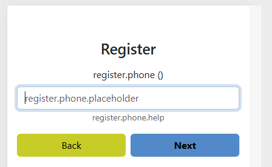

**Step: Password**

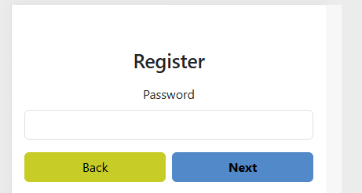

**Step: Access code (if required by configuration)**

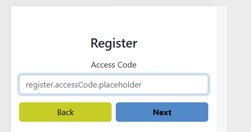

**Step: Country, city, and street**

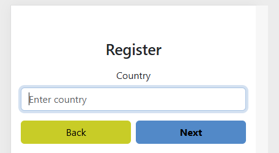

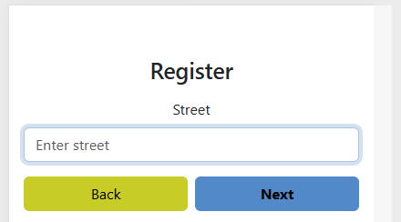

**Final summary before submitting**

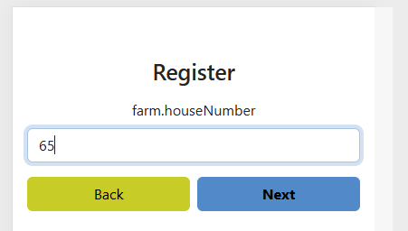
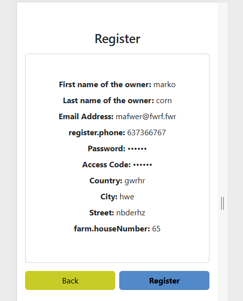

3. Confirm your information and click **Register**.
4. After successful registration, you will be redirected to the login page.

---

### 2.3 Login

To access your account:

1. Enter your email or username.
2. Type your password.
3. Click **Login**.

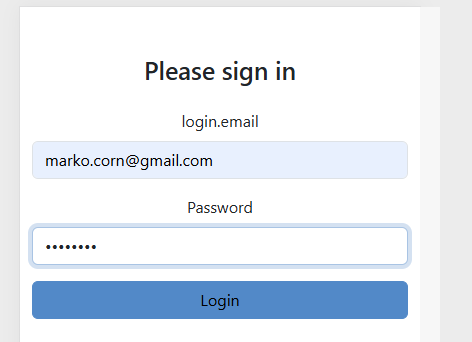

After logging in, you will be redirected to the dashboard.

---

## 3. Navigation Overview

After logging in, you will see a clear dashboard with quick access to the main modules:

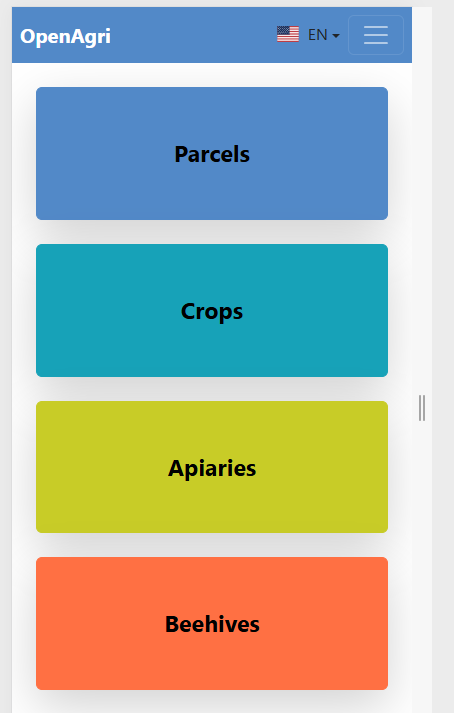  
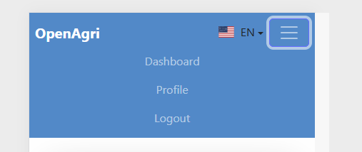

You can navigate between:

- **Farm**
- **Parcel**
- **Apiary**
- **Beehive**
- **Crop**
- Language selection (EN / SL)
- Logout

---

## 4. Farm Management

*(Screenshots for farm management will be added once available.)*

---

## 5. Parcel Management

### 5.1 Viewing Parcels

1. Click **Parcel** in the navigation bar.
2. Here you can view, search, and open existing parcels.

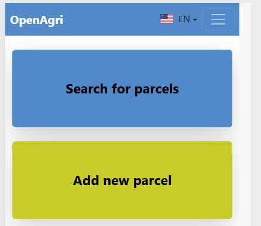
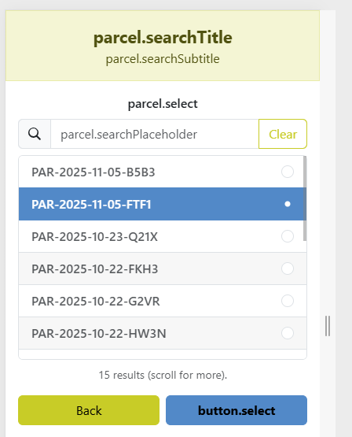

---

### 5.2 Adding a Parcel

1. On the parcel screen, click **Add parcel**.
2. The wizard allows you to:
    - Select the parcel location on a map
    - Enter parcel size
    - Confirm the data

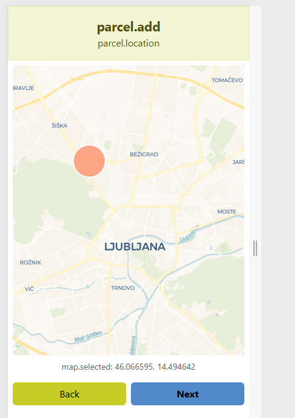  
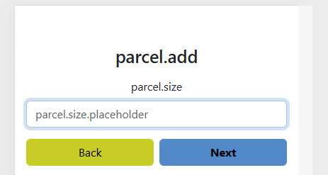  
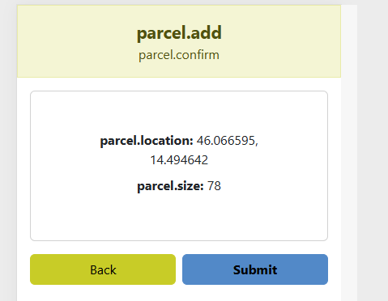

---

### 5.3 Searching for Parcels

Use the search field or filters (if enabled) to locate a parcel.

---

## 6. Apiary Management

### 6.1 Viewing Apiaries

1. Click **Apiary** in the navigation.
2. You will see a list of apiaries in your farm.

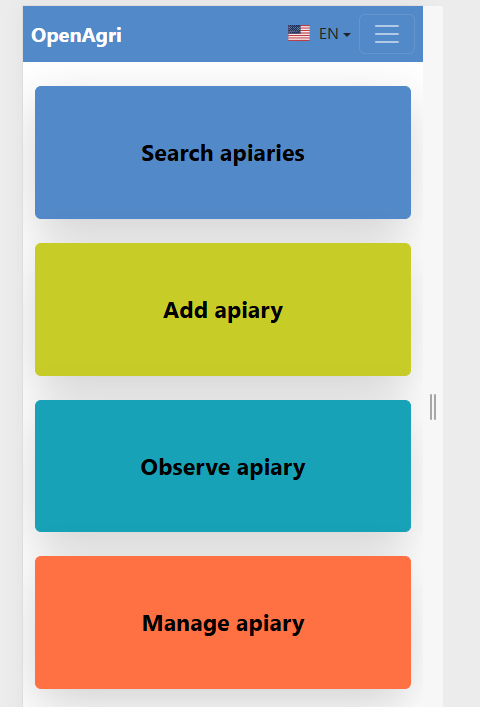

---

### 6.2 Adding an Apiary

The **Add Apiary** wizard guides you through picking a location and entering details like name or notes.

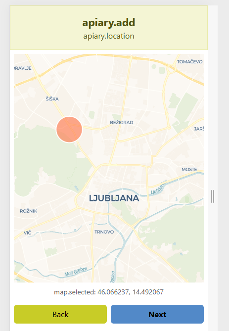  
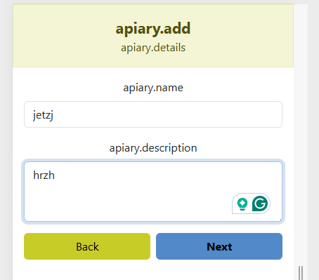  
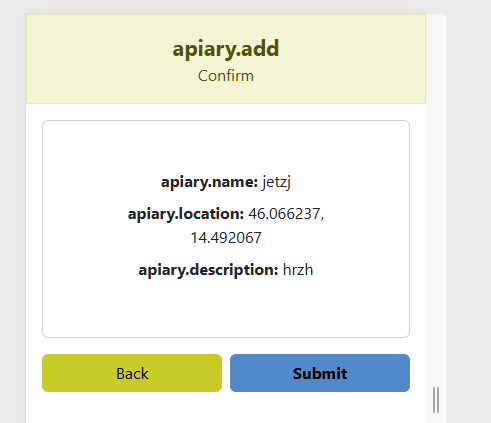

---

### 6.3 Managing an Existing Apiary

You can update and perform actions on an existing apiary:

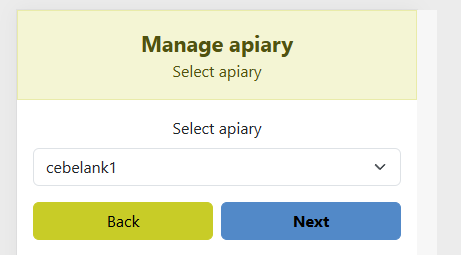  
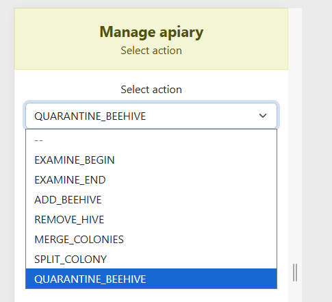  
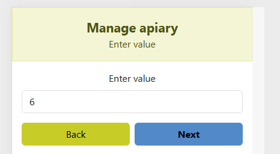  
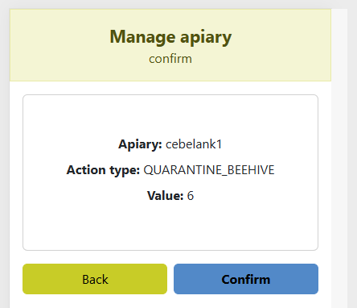

---

## 7. Apiary Search Wizard – Observations and Actions

This tool allows you to view all recorded **observations** and **actions** for a chosen apiary.

### 7.1 Step 1: Choose Category

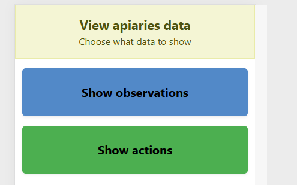

### 7.2 Step 2: Select Apiary

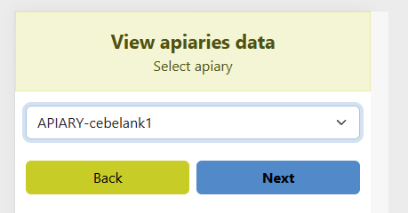  
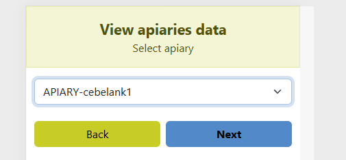

### 7.3 Step 3: View Results

Results are displayed in a clean list with timestamps, categories, and values.

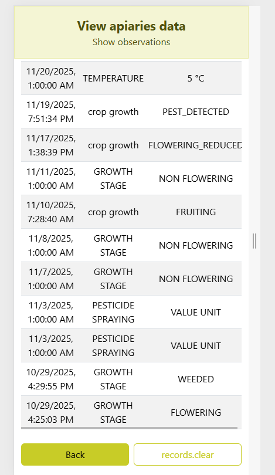  
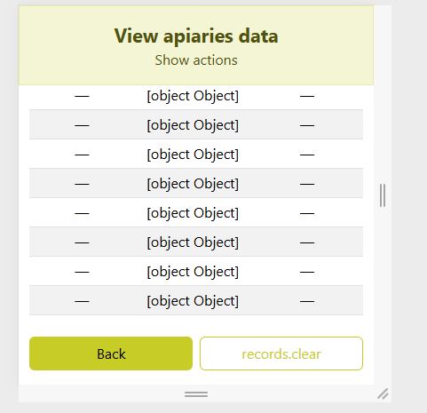

### 7.4 Recording Observations on an Apiary

You can also record observations directly using the **Observe Apiary** wizard.

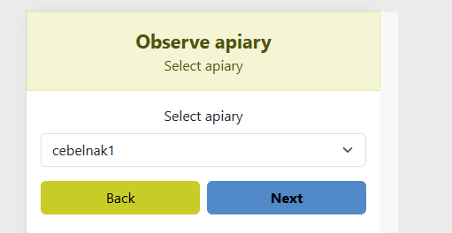  
  
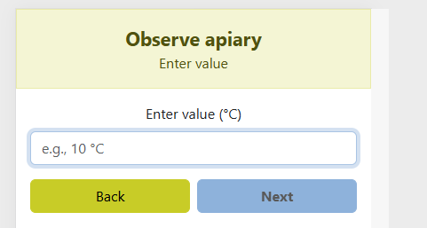  
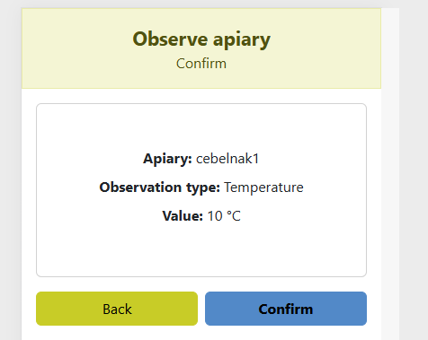

---

## 8. Beehive Management

### 8.1 Viewing Beehives

Click **Beehive** to access your beehive list.

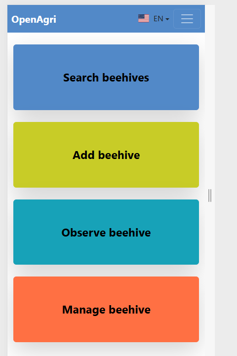  
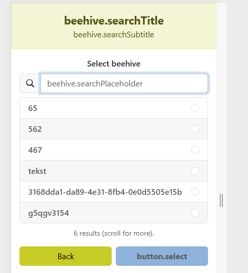

---

### 8.2 Adding a Beehive

Use the wizard to assign the beehive to an existing apiary and fill in hive information.

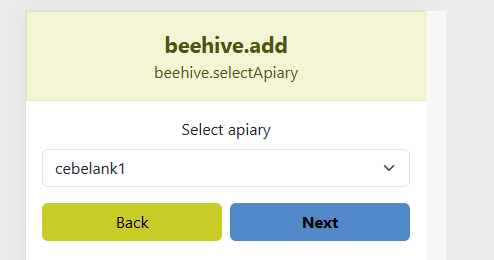  
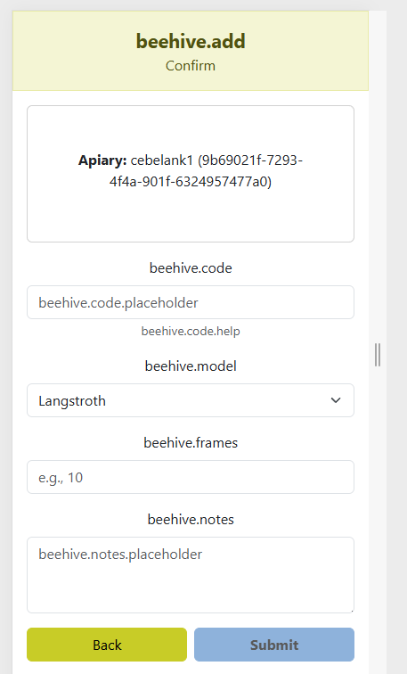

---

### 8.3 Managing a Beehive

You can update hive status, perform actions, and edit hive data.

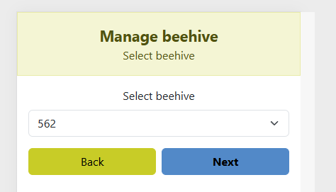  
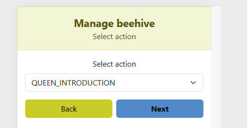  
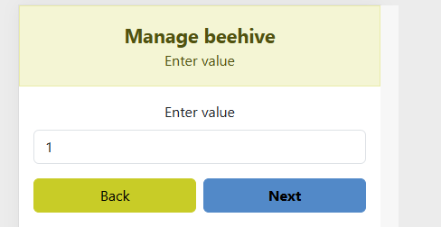  
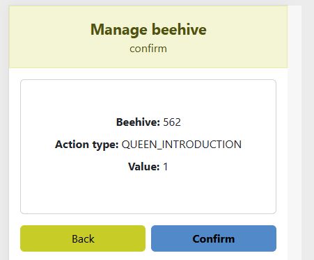

---

## 9. Crop Management

### 9.1 Viewing Crops

Click **Crop** to see all crops associated with your parcels.

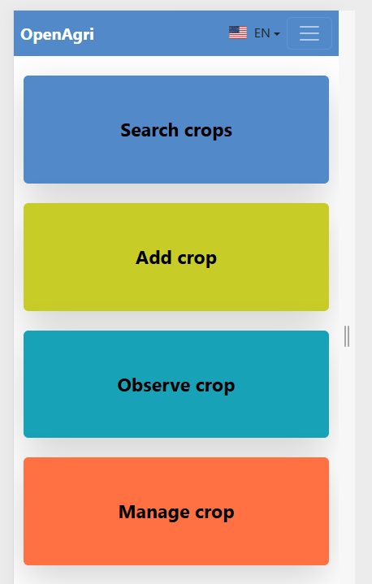  
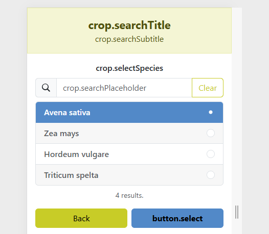

---

### 9.2 Adding a Crop

Use the wizard to choose the parcel, crop species, and planting details.

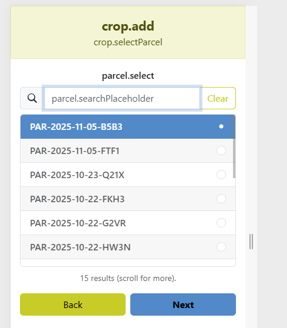  
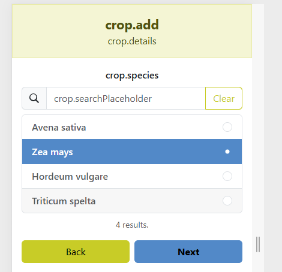  
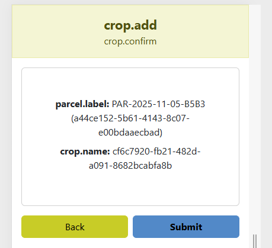

---

### 9.3 Managing a Crop

Record actions like fertilizing, watering, or harvesting.

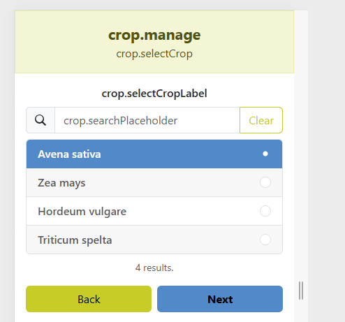  
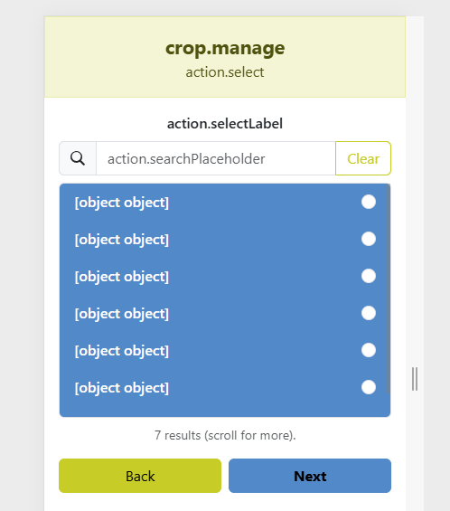  
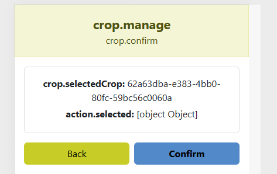

---

### 9.4 Recording Crop Observations

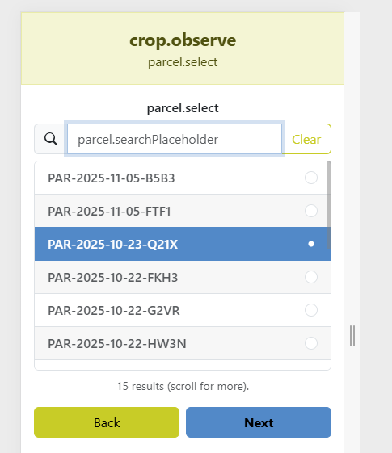  
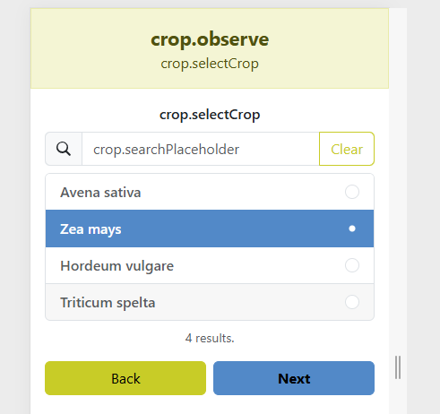  
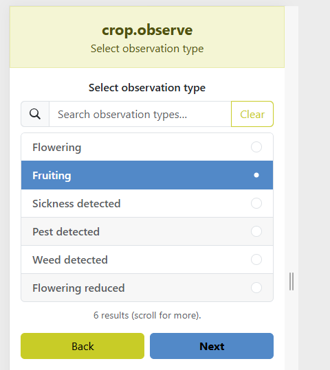  

---

## 10. Language Switching

Use the language selector in the top-right corner to quickly switch between languages.

---

## 11. Map View (Farms and Parcels)

If enabled, a map will be shown on the farm or parcel screens.

*(Add screenshots when available.)*

---

## 12. Logging Out

1. Open the main navigation menu.
2. Click **Logout**.
3. You will return to the login page and your session ends.

---

