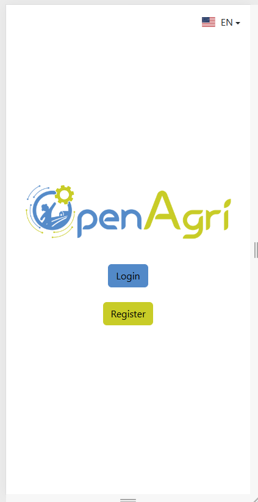
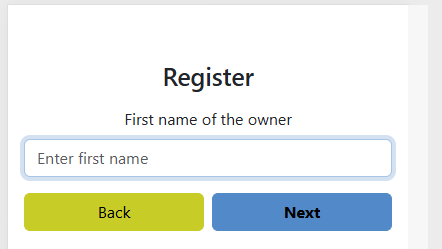
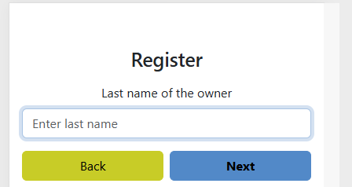
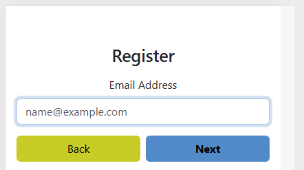

Below is a concise user manual in Markdown. You can paste it into a new `USER_MANUAL.md` in the project root and later insert screenshots where indicated.

---

# Open Agri UI \- User Manual

## 1\. Introduction

Open Agri UI is a web application for managing farms, parcels, apiaries (beehives), and crops. It lets you:

- Register and log in
- Create and manage farms and parcels
- Create and manage apiaries and beehives
- Record and search apiary observations and actions
- Create and manage crops and record crop observations

Screenshots will be added later in the indicated sections.

---

## 2\. Getting Started

### 2\.1 Accessing the Application

1. Open your web browser.
2. Navigate to the app URL (provided by your administrator or deployment).
3. The home page or login page is displayed.

*Home page*

### 2\.2 Registration

If you do not have an account:

1. Click the *Register* or *Sign up* button on the login screen.
2. Follow the registration wizard steps:
    - Step Email: Enter your email address.
    - Step Password: Choose a secure password.
    - Step Phone: Optionally enter a phone number.
    - Step Number / String: Provide any requested identification details (depending on configuration).
3. Confirm and submit the registration.
4. After successful registration, you may be redirected to the login page.

*Registration form - Step 1: Email*

*Registration form - Step 2: Password*

*Registration form - Step 3: Phone*

### 2\.3 Login

1. On the login page, enter your email or username.
2. Enter your password.
3. Click the *Login* button.
4. After successful login you are redirected to the dashboard.

> *Screenshot placeholder: Login form*

---

## 3\. Navigation Overview

After logging in, you will see the main navigation:

- Top navigation bar with:
    - Logo
    - Links to main modules:
        - Farm
        - Parcel
        - Apiary
        - Beehive
        - Crop
    - Language switcher (e\.g. `EN` / `SL`)
    - Login/Logout

> *Screenshot placeholder: Main navigation bar*

Use the navigation bar to move between modules.

---

## 4\. Farm Management

### 4\.1 Viewing Farms

1. Click `Farm` in the navigation bar.
2. The farm page shows available farms and quick filters.

> *Screenshot placeholder: Farm list*

### 4\.2 Searching for Farms

1. On the farm page, open `FarmSearch`.
2. Use the search form to filter by:
    - Name
    - Location
    - Other identifiers (depending on configuration).
3. Click *Search* to apply filters.
4. Results are shown in a list; select a farm to view details.

> *Screenshot placeholder: Farm search form and results*

### 4\.3 Quick Farm Selection

1. Open `FarmQuickPick`.
2. A simple list of farms is shown.
3. Click a farm entry to select it and open its details.

> *Screenshot placeholder: Farm quick pick*

---

## 5\. Parcel Management

### 5\.1 Viewing Parcels

1. Click `Parcel` in the navigation bar.
2. The parcel page lists existing parcels and basic information.

> *Screenshot placeholder: Parcel list*

### 5\.2 Adding a Parcel

1. On the parcel page, click *Add parcel* or open `ParcelAddWizard`.
2. Follow the wizard steps:
    - Enter parcel identifier or name.
    - Provide location and area information.
    - Assign the parcel to an existing farm.
3. Review and confirm to create the parcel.

> *Screenshot placeholder: Parcel add wizard*

### 5\.3 Searching for Parcels

1. Click `ParcelSearchWizard`.
2. Fill in search criteria (farm, code, location, etc.).
3. Click *Search*.
4. Select a parcel from the results to view or edit its details.

> *Screenshot placeholder: Parcel search wizard*

---

## 6\. Apiary Management

### 6\.1 Viewing Apiaries

1. Click `Apiary` in the navigation bar.
2. The apiary page shows a list of apiaries for your current farm.

> *Screenshot placeholder: Apiary list*

### 6\.2 Adding an Apiary

1. On the apiary page, open `ApiaryAddWizard`.
2. Enter:
    - Apiary name or identifier.
    - Location (e\.g. coordinates or description).
    - Optional additional information.
3. Confirm the wizard to create the apiary.

> *Screenshot placeholder: Apiary add wizard*

### 6\.3 Managing an Existing Apiary

1. Select an apiary from the list.
2. Open `ApiaryManageWizzard` (manage wizard).
3. Update:
    - Basic properties (name, description, status).
    - Related data (e\.g. notes, configuration).
4. Save your changes.

> *Screenshot placeholder: Apiary manage wizard*

---

## 7\. Apiary Search Wizard \- Observations and Actions

The Apiary Search Wizard lets you view recorded *observations* and *actions* for a selected apiary. It works in three steps.

### 7\.1 Step 1: Choose Category

1. Navigate to `Apiary` \> `Search` (or `ApiarySearchWizzard`).
2. Step 1 (\*Category\*) appears.
3. Choose what you want to view:
    - *View observations*
    - *View actions*
4. Click one of the two large buttons. You are moved to Step 2 automatically.

> *Screenshot placeholder: Step 1 \- choose observations or actions*

### 7\.2 Step 2: Select Apiary

1. Step 2 (\*Select apiary\*) appears.
2. Use the dropdown list to choose the apiary whose records you want to see.
3. Click *Back* to return to category selection if needed.
4. Click *Next* to load the results for the selected apiary.

> *Screenshot placeholder: Step 2 \- apiary selector*

### 7\.3 Step 3: View Results

1. Step 3 (\*Results\*) appears.
2. At the top, you see the selected view type (actions or observations).
3. Use the view switch:
    - *Table view* \- records shown in a table with:
        - Date & time
        - Type (observation / activity / property)
        - Value (with unit)
    - *Card view* \- each record displayed as a card with:
        - Title (type)
        - Date & time
        - Value (with unit)
4. If loading is in progress, a spinner and “Please wait…” message are shown.
5. If there are no records, a “No records found” message is displayed.
6. Use the buttons at the bottom:
    - *Back* \- returns to Step 2 (apiary selection).
    - *Clear selection* \- resets the wizard (mode, apiary, and view style) and returns to Step 1.

> *Screenshot placeholder: Step 3 \- table view*  
> *Screenshot placeholder: Step 3 \- card view*

---

## 8\. Beehive Management

### 8\.1 Viewing Beehives

1. Click `Beehive` in the navigation bar.
2. The beehive page shows a list of beehives, usually grouped or filtered by apiary.

> *Screenshot placeholder: Beehive list*

### 8\.2 Adding a Beehive

1. On the beehive page, open `BeehiveAddWizzard`.
2. Follow the steps:
    - Choose apiary.
    - Enter beehive identifier or name.
    - Configure hive details (e\.g. type, notes).
3. Confirm to create the beehive.

> *Screenshot placeholder: Beehive add wizard*

### 8\.3 Managing a Beehive

1. Select a beehive from the list or via `BeehiveSearchWizzard`.
2. Open `BeehiveManageWizard`.
3. Update details such as:
    - Hive status
    - Notes or technical data
4. Save changes.

> *Screenshot placeholder: Beehive manage wizard*

---

## 9\. Crop Management

### 9\.1 Viewing Crops

1. Click `Crop` in the navigation bar.
2. The crop page shows crops associated with parcels/farms.

> *Screenshot placeholder: Crop list*

### 9\.2 Adding a Crop

1. Open `CropAddWizzard`.
2. Select:
    - Farm and parcel.
    - Crop species/type from the list.
3. Provide planting/establishment details (dates, area, density if applicable).
4. Confirm to create the crop.

> *Screenshot placeholder: Crop add wizard*

### 9\.3 Managing a Crop

1. Select a crop from the list or via `CropSearchWizzad`.
2. Open `CropManageWizard`.
3. Manage actions on the crop, for example:
    - Sowing
    - Watering
    - Fertilizing
    - Harvesting
    - Pest control
4. Save recorded actions and updates.

> *Screenshot placeholder: Crop manage wizard*

### 9\.4 Recording Crop Observations

1. From the crop details, open `CropObserveWizzard`.
2. Choose the observation type, such as:
    - Flowering
    - Fruiting
    - Sickness detected
    - Pest detected
    - Weed detected
    - Flowering reduced
3. Specify the observation time and any relevant notes.
4. Save the observation.

> *Screenshot placeholder: Crop observe wizard*

---

## 10\. Language Switching

The app supports multiple languages.

1. Locate the Language Switcher in the navigation bar.
2. Click on the language code (e\.g. `EN`, `SL`).
3. Choose the desired language.
4. The UI texts (menus, labels, buttons) update to the selected language.

> *Screenshot placeholder: Language switcher*

---

## 11\. Map View (Farms and Parcels)

If enabled, the `FarmMap` component shows a map of farms and/or parcels.

1. Open the farm or parcel page that includes the map.
2. Use the map controls to:
    - Zoom in/out.
    - Click on farm or parcel markers to view details.
3. Use filters or search tools to highlight particular entities.

> *Screenshot placeholder: Farm/parcel map view*

---

## 12\. Logging Out

1. Open the main navigation bar.
2. Click the *Logout* option.
3. You are returned to the login page, and your session is closed.

> *Screenshot placeholder: Logout button*

---

## 13\. Troubleshooting

### 13\.1 I cannot see any farms, apiaries, or crops

- Ensure you are logged in with the correct user.
- Check that farms and related entities have been created for your account.
- Use search wizards (farm, parcel, apiary, beehive, crop) with broader criteria.

### 13\.2 I see an error when loading records

- Wait a few seconds and try again.
- Verify your network connection.
- If the error persists, contact the system administrator and provide:
    - The screen where the error occurred.
    - The approximate time of the error.

---

_End of user manual._